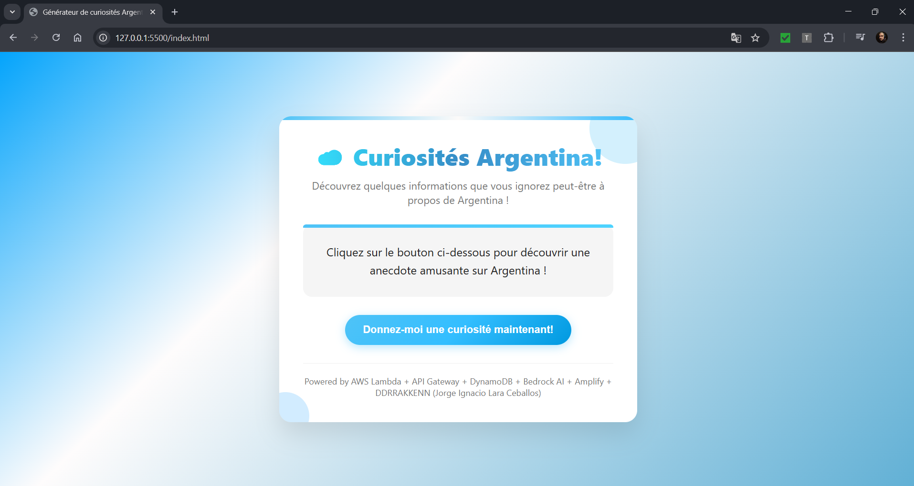

# ☁️ Generador de Curiosidades Argentina

Aplicación web serverless que genera datos curiosos sobre Argentina utilizando inteligencia artificial y servicios de AWS.



## 📋 Descripción

Esta aplicación permite a los usuarios descubrir datos curiosos sobre Argentina con solo hacer clic en un botón. Utiliza AWS Bedrock AI para generar contenido dinámico en cada solicitud.

## 🏗️ Arquitectura

```
Usuario → AWS Amplify → API Gateway → Lambda → DynamoDB
                                              → Bedrock AI
```

### Componentes:

- **AWS Amplify**: Hosting del archivo HTML
- **API Gateway**: Endpoint REST para las peticiones HTTP
- **AWS Lambda**: Función serverless que procesa las solicitudes
- **Amazon DynamoDB**: Base de datos NoSQL para almacenar los datos
- **AWS Bedrock**: Servicio de IA generativa para crear el contenido

## 🚀 Tecnologías

- HTML5 + CSS3 + JavaScript
- AWS Lambda
- API Gateway
- DynamoDB
- AWS Bedrock
- AWS Amplify

## 📁 Estructura del Proyecto

```
argentina-funfacts/
│
├── index.html          # Aplicación web completa
└── README.md
```

## 🛠️ Guía de Implementación

### 1. Crear Tabla en DynamoDB

1. Abrir la consola de **AWS DynamoDB**
2. Click en **"Create table"**
3. Configurar:
   - **Table name**: `argentina-funfacts`
   - **Partition key**: `id` (String)
4. Dejar las demás opciones por defecto
5. Click en **"Create table"**

### 2. Habilitar AWS Bedrock

1. Abrir la consola de **AWS Bedrock**
2. Ir a **"Model access"** en el menú lateral
3. Click en **"Manage model access"** o **"Edit"**
4. Seleccionar los modelos que necesitas (ejemplo: Claude, Titan)
5. Click en **"Request model access"**
6. Esperar la aprobación (generalmente es automática)

### 3. Crear Función Lambda

#### 3.1 Crear la función

1. Abrir la consola de **AWS Lambda**
2. Click en **"Create function"**
3. Seleccionar **"Author from scratch"**
4. Configurar:
   - **Function name**: `argentina-funfact-generator`
   - **Runtime**: Python 3.11 o Node.js 18.x
   - **Architecture**: x86_64
5. Click en **"Create function"**

#### 3.2 Configurar permisos

1. En la página de la función, ir a **"Configuration"** → **"Permissions"**
2. Click en el nombre del rol (ej: `argentina-funfact-generator-role-xxxxx`)
3. Click en **"Add permissions"** → **"Attach policies"**
4. Buscar y agregar:
   - `AmazonDynamoDBFullAccess`
   - `AmazonBedrockFullAccess`
5. Click en **"Add permissions"**

#### 3.3 Escribir el código

En la pestaña **"Code"**, reemplazar el código con:

**Para Python:**
```python
import json
import boto3
import time
from datetime import datetime

# Inicializar clientes
bedrock_runtime = boto3.client('bedrock-runtime', region_name='us-east-1')
dynamodb = boto3.resource('dynamodb', region_name='us-east-1')
table = dynamodb.Table('argentina-funfacts')

def lambda_handler(event, context):
    try:
        # Prompt para Bedrock
        prompt = "Genera un dato curioso interesante sobre Argentina en francés. Debe ser educativo y sorprendente. Solo devuelve el dato curioso, sin introducción ni explicaciones adicionales."
        
        # Llamar a Bedrock AI
        body = json.dumps({
            "prompt": f"\n\nHuman: {prompt}\n\nAssistant:",
            "max_tokens_to_sample": 300,
            "temperature": 0.7,
            "top_p": 1,
        })
        
        response = bedrock_runtime.invoke_model(
            modelId='anthropic.claude-v2',
            contentType='application/json',
            accept='application/json',
            body=body
        )
        
        response_body = json.loads(response['body'].read())
        fact = response_body['completion'].strip()
        
        # Guardar en DynamoDB
        table.put_item(
            Item={
                'id': str(int(time.time() * 1000)),
                'fact': fact,
                'timestamp': datetime.now().isoformat()
            }
        )
        
        return {
            'statusCode': 200,
            'headers': {
                'Content-Type': 'application/json',
                'Access-Control-Allow-Origin': '*',
                'Access-Control-Allow-Headers': 'Content-Type',
                'Access-Control-Allow-Methods': 'GET,OPTIONS'
            },
            'body': json.dumps({'fact': fact})
        }
        
    except Exception as e:
        print(f"Error: {str(e)}")
        return {
            'statusCode': 500,
            'headers': {
                'Access-Control-Allow-Origin': '*'
            },
            'body': json.dumps({'error': 'Error al generar el dato curioso'})
        }
```

#### 3.4 Configurar timeout

1. Ir a **"Configuration"** → **"General configuration"**
2. Click en **"Edit"**
3. Cambiar **"Timeout"** a `30` segundos
4. Click en **"Save"**

#### 3.5 Desplegar el código

1. Click en **"Deploy"** (botón naranja arriba del editor)
2. Esperar confirmación: "Successfully updated the function..."

### 4. Configurar API Gateway

#### 4.1 Crear la API

1. Abrir la consola de **API Gateway**
2. Click en **"Create API"**
3. Seleccionar **"REST API"** (no REST API Private)
4. Click en **"Build"**
5. Configurar:
   - **Protocol**: REST
   - **Create new API**: New API
   - **API name**: `argentina-funfacts-api`
   - **Endpoint Type**: Regional
6. Click en **"Create API"**

#### 4.2 Crear el recurso

1. En la API creada, click en **"Actions"** → **"Create Resource"**
2. Configurar:
   - **Resource Name**: `funfact`
   - **Resource Path**: `/funfact`
3. Click en **"Create Resource"**

#### 4.3 Crear el método GET

1. Seleccionar el recurso `/funfact`
2. Click en **"Actions"** → **"Create Method"**
3. Seleccionar **"GET"** en el dropdown
4. Click en el checkmark ✓
5. Configurar:
   - **Integration type**: Lambda Function
   - **Use Lambda Proxy integration**: ✓ (marcar)
   - **Lambda Region**: us-east-1
   - **Lambda Function**: `argentina-funfact-generator`
6. Click en **"Save"**
7. Click en **"OK"** cuando pregunte sobre permisos

#### 4.4 Habilitar CORS

1. Seleccionar el recurso `/funfact`
2. Click en **"Actions"** → **"Enable CORS"**
3. Dejar los valores por defecto
4. Click en **"Enable CORS and replace existing CORS headers"**
5. Click en **"Yes, replace existing values"**

#### 4.5 Desplegar la API

1. Click en **"Actions"** → **"Deploy API"**
2. Configurar:
   - **Deployment stage**: [New Stage]
   - **Stage name**: `prod`
3. Click en **"Deploy"**
4. **COPIAR la URL** que aparece arriba: `Invoke URL: https://xxxxxxxxxx.execute-api.us-east-1.amazonaws.com/prod`

### 5. Actualizar el Frontend

1. Abrir el archivo **`index.html`**
2. Buscar la línea:
```javascript
const API_URL = 'https://n6dv2fmuq0.execute-api.us-east-1.amazonaws.com/funfact';
```
3. Reemplazar con tu URL (agregar `/funfact` al final):
```javascript
const API_URL = 'https://TU-ID-AQUI.execute-api.us-east-1.amazonaws.com/prod/funfact';
```
4. Guardar el archivo

### 6. Desplegar en AWS Amplify

#### 6.1 Crear la aplicación

1. Abrir la consola de **AWS Amplify**
2. Click en **"Get Started"** (sección "Amplify Hosting")
3. Seleccionar **"Deploy without Git provider"**
4. Click en **"Continue"**

#### 6.2 Subir el archivo

1. Configurar:
   - **App name**: `argentina-funfacts`
   - **Environment name**: `main`
2. Arrastrar el archivo **`index.html`** a la zona de "Drag and drop"
3. Click en **"Save and deploy"**
4. Esperar a que termine el despliegue (1-2 minutos)
5. Click en la URL generada para abrir la aplicación

### 7. Probar la Aplicación

1. Abrir la URL de Amplify en el navegador
2. Click en **"Donnez-moi une curiosité maintenant!"**
3. Esperar unos segundos
4. Debería aparecer un dato curioso sobre Argentina en francés

## 📝 Endpoint de la API

**URL**: `https://n6dv2fmuq0.execute-api.us-east-1.amazonaws.com/funfact`

**Método**: `GET`

**Respuesta**:
```json
{
  "fact": "L'Argentine est le huitième plus grand pays du monde..."
}
```

## 🔄 Flujo de la Aplicación

1. Usuario abre la página (Amplify)
2. Usuario hace click en el botón
3. JavaScript llama a API Gateway (GET)
4. API Gateway invoca Lambda
5. Lambda llama a Bedrock AI para generar el texto
6. Lambda guarda el dato en DynamoDB
7. Lambda devuelve el dato a API Gateway
8. API Gateway devuelve la respuesta al navegador
9. JavaScript muestra el dato en pantalla

## 🔍 Solución de Problemas

### "Could not fetch fact. Check your API endpoint!"

**Causa**: La URL de la API no es correcta o la API no responde

**Solución**:
1. Verificar que la URL en `index.html` es correcta
2. Verificar que la API está desplegada en API Gateway
3. Probar la URL directamente en el navegador

### Error 403 Forbidden

**Causa**: Falta configurar CORS o permisos

**Solución**:
1. Verificar que CORS está habilitado en API Gateway
2. Re-desplegar la API después de cambiar CORS

### Error 500 o timeout

**Causa**: Lambda no tiene permisos o Bedrock no funciona

**Solución**:
1. Verificar que Lambda tiene permisos para Bedrock y DynamoDB
2. Verificar que solicitaste acceso a los modelos en Bedrock
3. Aumentar el timeout de Lambda a 30 segundos
4. Revisar CloudWatch Logs para ver el error específico

### La página carga pero no pasa nada

**Causa**: JavaScript no se está ejecutando o hay un error

**Solución**:
1. Abrir las herramientas de desarrollo (F12)
2. Ver la pestaña "Console" para errores
3. Ver la pestaña "Network" para ver si la petición se envía

## 👨‍💻 Autor

**DDRRAKKENN (Jorge Ignacio Lara Ceballos)**

---

**Stack completo**: AWS Amplify + API Gateway + Lambda + DynamoDB + Bedrock AI
